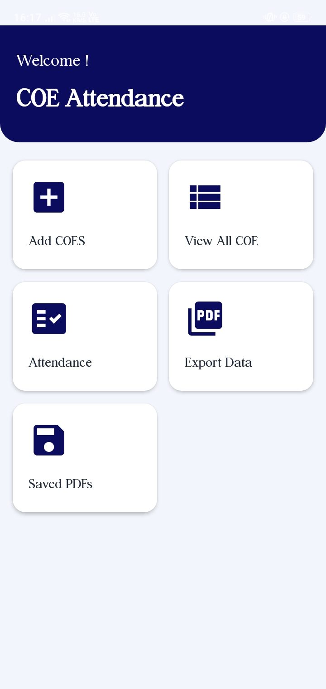
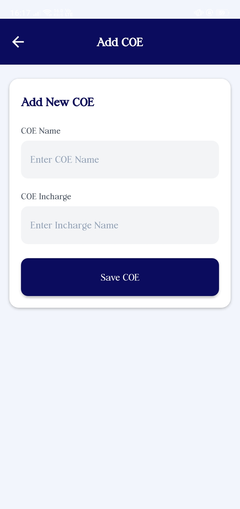
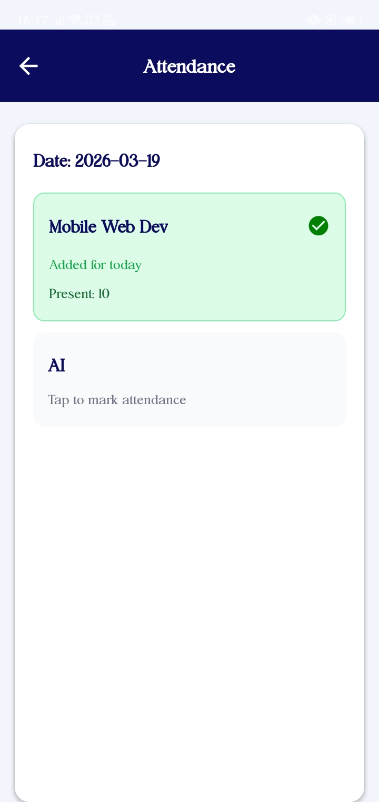
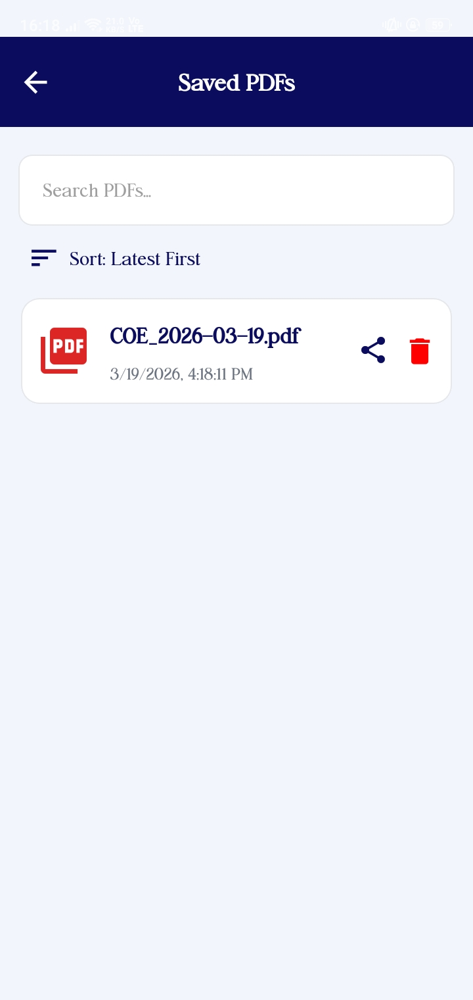

# CIT CoE Attendance System

[](https://github.com/Roshan-Metrix/coe_daily_attendance_system/graphs/contributors)

A comprehensive mobile application for managing daily attendance and lab documentation for the Center of Excellence (CoE) at CIT, Chennai. Built with React Native and Expo, this system streamlines attendance tracking and captures lab working environment photos.

## Features

- 📱 **Daily Attendance Tracking** - Easy-to-use interface for marking attendance
- 📸 **Lab Photo Capture** - Automatic photo logging of the lab environment
- 📊 **Attendance Reports** - View and manage attendance records
- 🔐 **Secure Authentication** - User login and role-based access
- 🚀 **Cross-platform** - Works on both iOS and Android devices

## Screenshots

[Add your screenshots here]

| | | | | |
|---|---|---|---|---|
|  |  |  |  |  |

## Prerequisites

Before you begin, ensure you have the following installed:
- Node.js (v14 or higher)
- npm or yarn
- Expo CLI

## Installation & Setup

### Clone the Repository

```bash
git clone https://github.com/Roshan-Metrix/coe_daily_attendance_system.git
cd coe_daily_attendance_system
```

### Install Dependencies

```bash
npm install
# or
yarn install
```

### Start the Development Server

```bash
expo start
```

Then:
- Press `a` to open in Android emulator
- Press `i` to open in iOS simulator
- Scan the QR code with Expo Go app on your mobile device

## Contributing

We welcome contributions! Follow these steps to contribute:

1. **Fork the Repository**
   ```bash
   git clone https://github.com/Roshan-Metrix/coe_daily_attendance_system.git
   ```

2. **Create a Feature Branch**
   ```bash
   git checkout -b feature/YourFeatureName
   ```

3. **Make Your Changes**
   - Write clean, readable code
   - Follow existing code style
   - Add comments where necessary

4. **Commit Your Changes**
   ```bash
   git commit -m "Add your meaningful commit message"
   ```

5. **Push to Your Fork**
   ```bash
   git push origin feature/YourFeatureName
   ```

6. **Create a Pull Request**
   - Describe your changes clearly
   - Reference any related issues

## Tech Stack

- **React Native** - Mobile framework
- **Expo** - Development platform
- **JavaScript** - Programming language

## Project Structure

```
coe_daily_attendance_system/
├── src/
│   ├── components/
│   ├── screens/
│   ├── navigation/
│   └── utils/
├── assets/
├── App.js
├── app.json
└── package.json
```

## License

This project is licensed under the MIT License - see the [LICENSE](./license.txt) file for details.

## About the Developer

**Roshan Metrix**

This project was developed as part of the CIT Center of Excellence initiative to streamline and modernize the attendance and lab documentation process.

- GitHub: [@Roshan-Metrix](https://github.com/Roshan-Metrix)

## Support

For issues, bugs, or feature requests, please open an issue on the [GitHub repository](https://github.com/Roshan-Metrix/coe_daily_attendance_system/issues).

---

**Made with ❤️ for CIT CoE** 